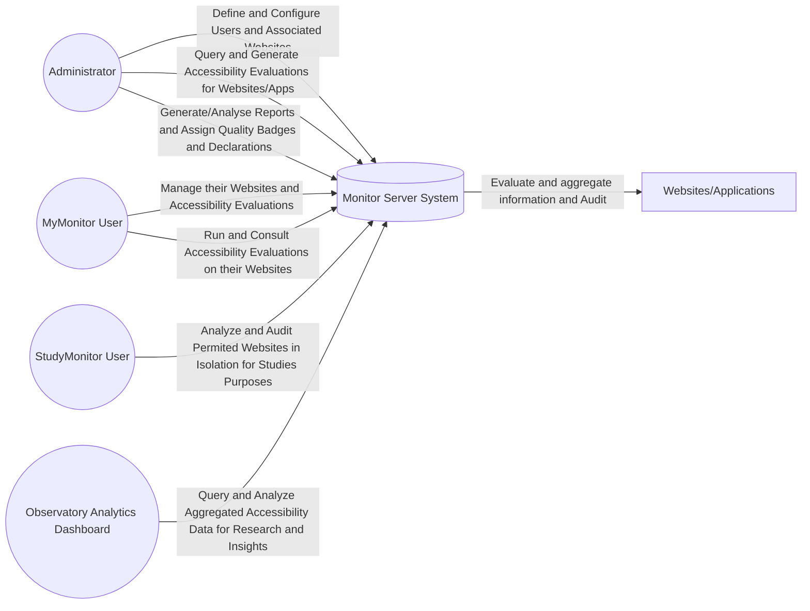
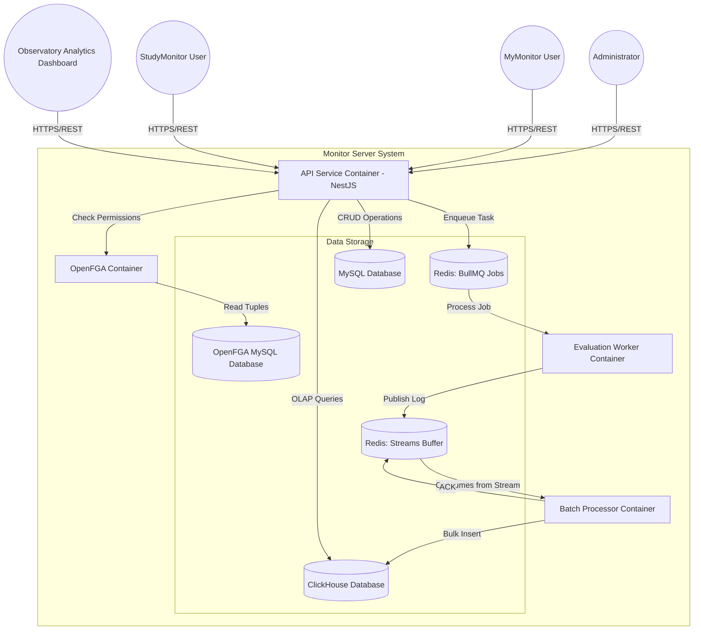
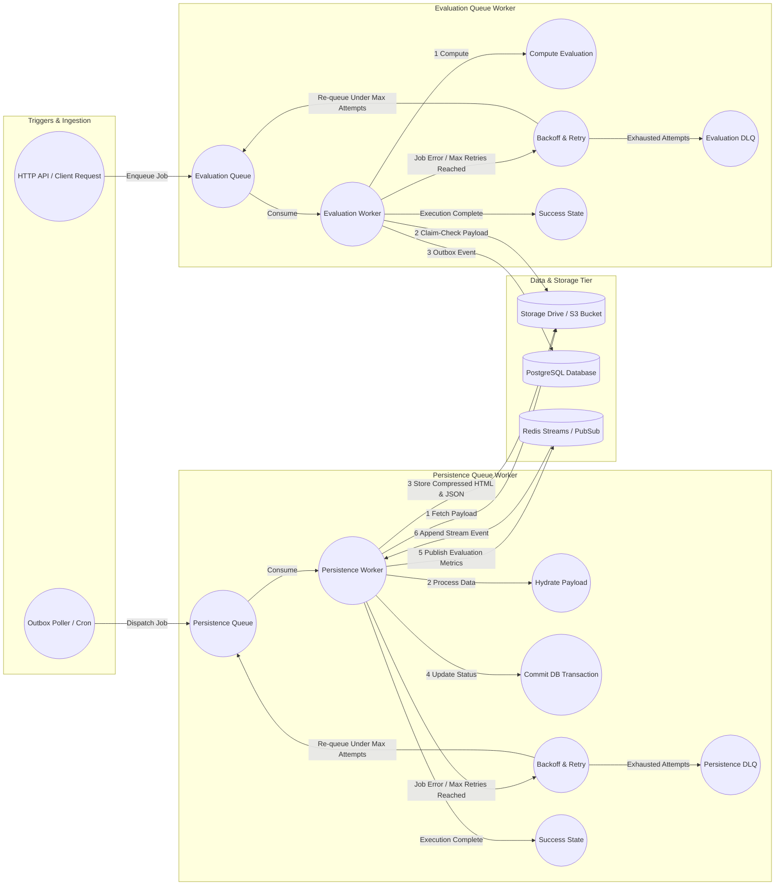

# Monitor Server System

Bem-vindo ao repositório do Monitor Server System.

## Arquitetura
Para uma visão detalhada sobre o desenho do sistema, incluindo os contextos de negócio e a estrutura técnica de contêineres, consulta a nossa documentação oficial:

# System Architecture

## Level 1: Business Context

## Level 2: Container Architecture

## Evaluation Processing 

## Evaluation Data Ingestion
```mermaid
graph TD
    %% Ingestion
    Input[Data Sources] --> RedisStream[Redis Stream]

    subgraph Ingestion_Layer [Ingestion Layer]
        RedisStream --> |Consume| Batch[Batch Consumer]
        Batch --> |"ACK/XACK"| RedisStream
        RedisStream --> |"Recurrent Fail"| DLQ[Dead Letter Queue]
    end
    subgraph ClickhouseDB[ Clickhouse DB]
    Batch --> LogTable[Source of Truth - Evaluations]
    
    %% Transformation
    LogTable -->|"Materialized View Triggers"| MVs[Snapshots MVs]
    
    subgraph Snapshots [Materialized Snapshots]
        Global[Global]
        Web[Websites]
        Pag[Pages]
        Dir[Directories]
        Ent[Institutions]
    end
    
    MVs --> Global & Web & Pag & Dir & Ent
    end
    %% Query
    Global & Web & Pag & Dir & Ent --> Consult[Analytics API - Read Optimized]

   ```
