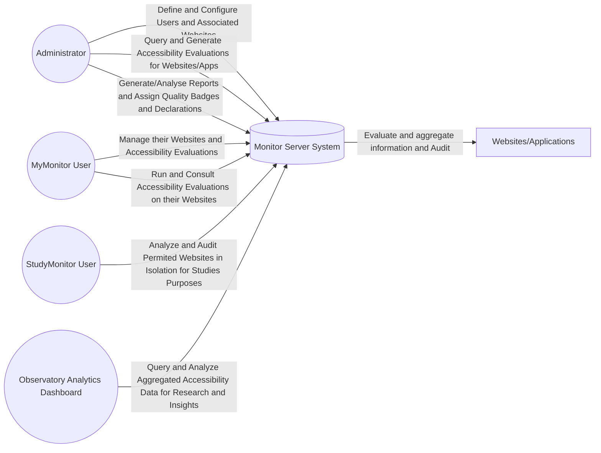
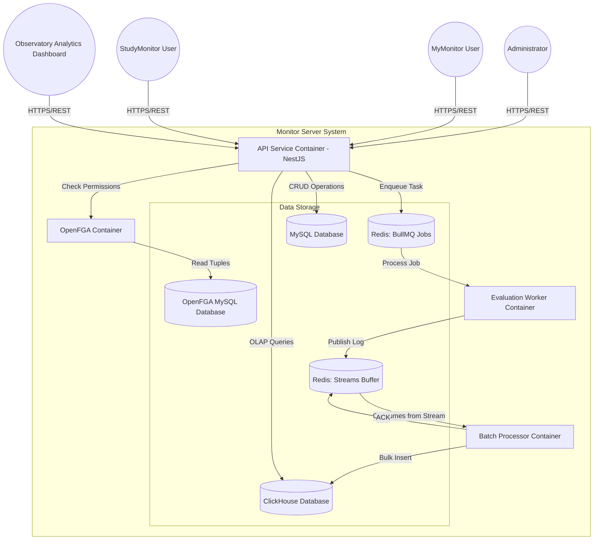

# Monitor Server System

Bem-vindo ao repositório do Monitor Server System.

## Arquitetura
Para uma visão detalhada sobre o desenho do sistema, incluindo os contextos de negócio e a estrutura técnica de contêineres, consulta a nossa documentação oficial:

# System Architecture

## Level 1: Business Context

## Level 2: Container Architecture
