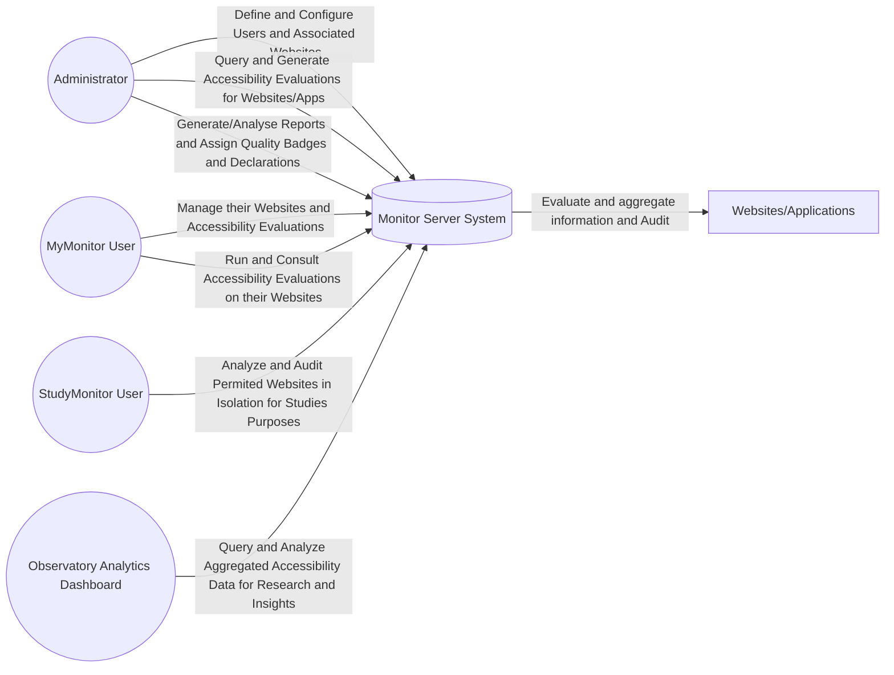

# System Architecture

## Level 1: Business Context

```mermaid
graph LR
    %% Atores
    User((Administrator))
    MyMonitorUser((MyMonitor User))
    StudyMonitorUser((StudyMonitor User))
    Observatory((Observatory Analytics Dashboard))
    %% Sistemas Externos
    TargetWeb[Websites/Applications]

    %% O Nosso Sistema (Cenário de Nível 1)
    MonitorSystem[("Monitor Server System")]

    %% Fluxos de Negócio
    User -->|Define and Configure Users and Associated Websites| MonitorSystem
    User -->|Query and Generate Accessibility Evaluations for Websites/Apps| MonitorSystem
    User -->|Generate/Analyse Reports and Assign Quality Badges and Declarations| MonitorSystem
    MyMonitorUser -->|Manage their Websites and Accessibility Evaluations| MonitorSystem
    MyMonitorUser -->|Run and Consult Accessibility Evaluations on their Websites| MonitorSystem
    StudyMonitorUser -->|Analyze and Audit Permited Websites in Isolation for Studies Purposes| MonitorSystem
    MonitorSystem -->|Evaluate and aggregate information and Audit| TargetWeb
    Observatory -->|Query and Analyze Aggregated Accessibility Data for Research and Insights| MonitorSystem

```

## Level 2: Container Architecture
